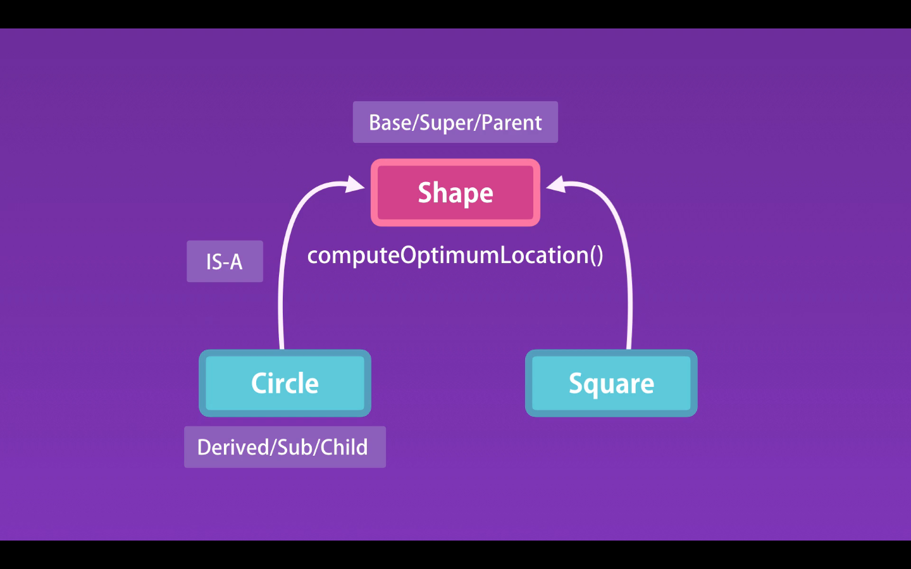

# 01- Inheritance

### Bu dersde geldikde çox qısa xülasə ilə izah:
- ilk olaraq şəkilə bax və nə olduğunu yadına sal.
    - Bir circle classimiz var ve bu classin icinde muxtelif
      ComputeOptimumLocation metodumuz var ve tesevvur edekki sabah biz
      Square classini elave etmek istedik ama bu class hemde eynen cicle
      classindaki hemin metoda ehtiyacimiz var. Bu halda biz yene bir
      Square class-i yaratmaliyiq ve eynen hemin metodu da
      yeniden yaratmaliyiq ama biz tekrarciliq itemirik. Ve burada devreye
      İnheritence girir.
    - İnheritance ucun ne etmeliyik?- bir Shape classi yaradiriq
      ve bu metodu icine qoyuruq.ve Circle, Square classlari bu metodu
      Shape classindan miras alir.
      - Burada classlarimiz dedik ama bilirkki Javascriptde classlar yoxdur 
      Objectimiz var. Ve burada Prototypical Inheritence devreye girir.
      Ve buradan anlamaq olarki bizim iki cur inheritance-miz var, 
      classical ve prototypical. Classical inheritance class yoludur
      JSde bu yol yoxdur evezine proto prototypical inheritance var. 

## Inheritance
Here is an example. In the last section, we defined this circle object with this method. ComputerOptimumLocation.
Now for this discussion let's imagine here we're working with a class. So let's imagine circle is a class, and not an object.
I want to explain inheritance in these classical (class way) terms.
So we have this circle class with one computeOptimumLocation method. Let's imagine tomorrow we're going to add another class
to our application called square. And square also needs this computeOptimumLocation method.
For now let's imagine the implementation of this object is exactly the same across these two different classes,
you don't want to repeat this implementation.
Because if there is a bug in this application, you have to fix it in multiple places. Or if we decide to change the implementation
So that's when inheritance comes to the rescue. We can define a new class called Shape, put this method there,
and have circle and square inherit this method, of the shape of the class.

Summmary:

Inheritance lets one object acquire the properties and methods of another object or of the Parent Object.
And this makes it easy to reuse code in different.

If we have properties and method that are common to several Objects, we can define a general Object and theses objects will inherit from the general Object.

Lets imagen we have a Circle class and a Square class that have a need the same computeOptimumLocation() method.

With Inheritance both the Circle and Square could inherit a computeOptimumLocation() method from the Shape class.

Inheritance terms:

- The Shape class is ---> Base / Super / Parent  - base class, super class, parent class
- The Circle and Square classes are ---> Derived /Sub / Child - derived class, sub class, child class
- The inheritance relationship ---> IS-A

## Classical Inheritance vs Prototypical Inheritance

In JavaScript we do not have classes we have objects, thats when Prototypical Inheritance comes into place.
So essentially, we have two types of inheritance, classical and prototypical.
Classical inheritance is class way but In JavaScript we do not have classes we have objects.

