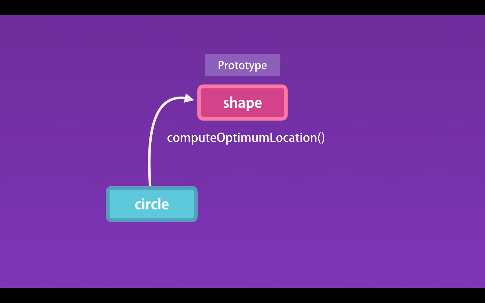

02- Prototypes and Prototypical Inheritance
Maksimum çalış ətraflı hər şeyi yaz, izahlar uzun olsa belə narahat olma yaz.

### Bu dersde geldikde çox qısa xülasə ilə izah:
- Ilk once bilmeyin lazimdirki, bu dersde sadece __proto__ nun ne oldugunu deyir. nece inheritance de istifade edersen onu demir 
  ONA GORE COX AYDIN OLMUR.

- Prototype sadece bir parentdir.
- Prototype sadece normal bir objectdir. Bunda xüsusi bir şey yoxdur.
  Hər bir objectin bir prototype-i yani parent-i var (Root object-dən başqa).
  Ve Bu object, prototipində tapdığımız bütün üzvləri miras alır veya uzvlere sahibdir.
  Bes bu prototip nedir haradan cixdi? - dedik axi her bir objectin prototypi ve ya parenti var.
- Ve bu prototype icinde ceshidli methodlar var. 
- Burada eslinde dusuhune bilerikki bir object yaratdiqda onun __proto__-su olur.
  Ve biz bir shape (parent) object yaradiriq ve bunun __proto__-sunda butun membersleri yaradiriq. 
  Indi biz bashqa child X objectini yaratdiqda isteyirikki bu object shape objectin butun memberslerine 
  sahib olsun ve bunun ucun biz bu objecti shape objectinden yaradiriq. Ve X objectini __proto__-sunda da göre bilersen
  .... buradakilari sonra yaza bilersen.
- X ve Y -> objectBase ( Prototype ) - yaniki x ve y-in prototype-i eynidir.
- Circel ve Square -> shapeBase ( prototype ) - yaniki Circel ve Square 
  
- ek bilgi, shape objectinin protosu var hansiki biz orada metodlar yaratdiq ama diger child X objectinin de protosu var.
  Dediyimiz kimi her bir objectin proto-su var.

Circle ve Square objectlerimiz var ve bu objectler bir parent shape objectden method ve property-leri alirlar.
Ve bu bir inheritance-dir.
Bu inheritance-ni js objectleri vasitesi ile nece ede bilerik.



We implemente the common methods in the Shape object. We refer to the Shape object as the Prototype of the Circle. Prototype is essencial the parent of another object

Every object in JavaScript has a parent (prototype) object, when we create a object, if we inspect that object in tha console we can see the following:

```javascript
let x = {};
// __proto__:
//     constructor: ƒ Object()
//     hasOwnProperty: ƒ hasOwnProperty()
//     isPrototypeOf: ƒ isPrototypeOf()
//     propertyIsEnumerable: ƒ propertyIsEnumerable()
//     toLocaleString: ƒ toLocaleString()
//     toString: ƒ toString()
//     valueOf: ƒ valueOf()
//     __defineGetter__: ƒ __defineGetter__()
//     __defineSetter__: ƒ __defineSetter__()
//     __lookupGetter__: ƒ __lookupGetter__()
//     __lookupSetter__: ƒ __lookupSetter__()
//     get __proto__: ƒ __proto__()
//     set __proto__: ƒ __proto__()
```

The property called `__proto__` is deprecated.

We can call any of this methods in our x object.

So x in an object and it has a link to another object, which is it's Prototype. This prototype, let's call it `objectBase`. Every Object in JavaScript inherits directly or indirectly from `objectBase`.

`objectBase` is the root of all object in JavaScript, and it does not have a parent or Prototype.

To get the Prototype of an object we can use: `Object.getPrototypeOf(x);`

When we call a method in an object JavaScript will start looking for that method in the object it self. If we can't find it will go all the way up to the root object we called objectBase.

A prototype is just a regular object in memory.

